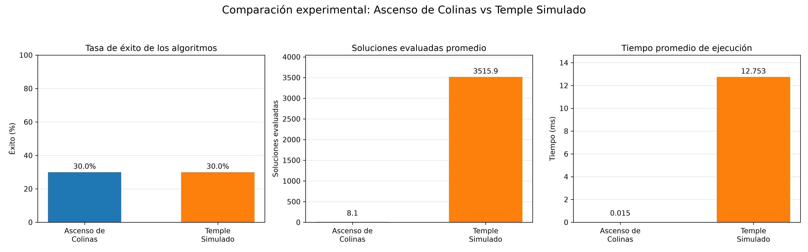

# Comparación experimental: Ascenso de Colinas vs Temple Simulado

Comparación de búsqueda local para el puzle 3 × 3. Ambos algoritmos usan la misma función de costo: número de fichas fuera de lugar, sin contar el hueco. La meta es `(1, 2, 3, 4, 5, 6, 7, 8, 0)` y tiene costo cero.

## Algoritmos

- **Ascenso de Colinas (HC):** evalúa todos los vecinos, elige el de menor costo y se detiene si ninguno mejora el estado actual. Puede quedar atrapado en una meseta o mínimo local.
- **Temple Simulado (TS):** evalúa un vecino aleatorio por iteración. Acepta mejoras y empates (`delta_E <= 0`); acepta un empeoramiento con probabilidad `exp(-delta_E / T)`.

## Método experimental

1. Con semilla `123`, se generan **30 estados iniciales solucionables, distintos y sin incluir la meta** mediante movimientos aleatorios desde la meta. Los movimientos solo sirven para crear la muestra; no son una variable de comparación.
2. HC se ejecuta una vez sobre cada estado y TS se ejecuta una vez sobre **esos mismos 30 estados**.
3. Ambos reciben el mismo presupuesto máximo de `5000` iteraciones. HC suele detenerse antes cuando no encuentra mejora.
4. Se calculan tres métricas: **tasa de éxito** (porcentaje que llega a la meta), **soluciones evaluadas promedio** (estados candidatos cuyo costo se calcula) y **tiempo promedio** en milisegundos.

Para reproducir el experimento:

```bash
pip install numpy matplotlib
python puzzle_colinas_temple.py
```

## Resultados

| Algoritmo | Éxito | Evaluaciones promedio | Tiempo promedio |
|---|---:|---:|---:|
| Ascenso de Colinas | 30.0 % | 8.1 | 0.015 ms |
| Temple Simulado | 30.0 % | 3515.9 | 12.753 ms |

Los porcentajes y las evaluaciones corresponden a la muestra reproducible con la semilla indicada. Los tiempos son de una ejecución de ejemplo y cambian según el equipo y la carga del sistema.



En esta muestra, ambos algoritmos alcanzaron la meta en 9 de los 30 estados. HC necesitó muchas menos evaluaciones y menos tiempo promedio. Una sola muestra de 30 estados no permite afirmar que las tasas de éxito sean iguales en general.

## Complejidad computacional

Si `k` es el número de iteraciones y `b` el número de vecinos por estado, el número de **evaluaciones de la función de costo** es:

```text
HC: O(k·b)
TS: O(k)
```

HC evalúa hasta `b` vecinos por iteración; TS evalúa uno. En el puzle 3 × 3, una posición de esquina tiene 2 vecinos, una de borde 3 y la central 4. Como el tablero tiene tamaño fijo, `b` está acotado por 4; las expresiones anteriores muestran la diferencia de evaluaciones por iteración, aunque ambas son `O(k)` si solo crece `k`.

La implementación de TS genera la lista de vecinos antes de seleccionar uno, por lo que la generación también tiene un costo `O(k·b)`. Ambos algoritmos guardan un historial de estados de hasta `k` iteraciones, con espacio `O(k)`. La tabla experimental informa el trabajo y el tiempo realmente observados con el mismo presupuesto máximo.
