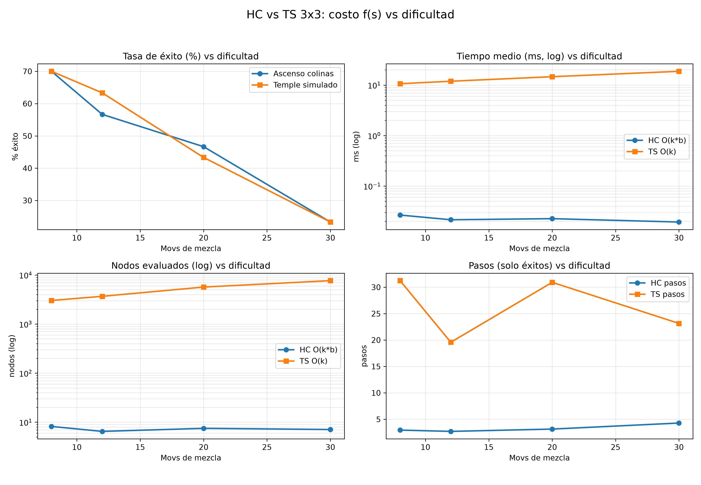

# Ascenso de Colinas y Temple Simulado en el 8-Puzzle (3x3)

Estudio de búsqueda local según diapositivas: **estado, vecindad y calidad/aptitud** de la solución con función objetivo `f(s)`. Comparación **Hill Climbing (HC)** frente a **Temple Simulado (TS)**.

Archivo principal: `puzzle_colinas_temple.py` · Requiere `Python 3.10+`, `numpy`, `matplotlib`.

Piezas del repo: `META`, `obtener_vecinos()`, `generar_estado_aleatorio()`, `costo()`, `ascenso_colinas()`, `temple_simulado()`, `experimento()`, `graficar_comparacion()`, `main`.

## 1. Modelo de clase

Estado: tupla de 9 `(1,2,3,4,5,6,7,8,0)`, `0` es el hueco. Meta `META = (1,2,3,4,5,6,7,8,0)`. Vecindad `obtener_vecinos(s)`: mover el hueco si es legal. Ramificación `b = 2 esquina, 3 borde, 4 centro, promedio 2.67`. Espacio soluble `9!/2 = 181440`. `generar_estado_aleatorio(movs)` mezcla desde `META`, siempre soluble.

Función objetivo:

```python
def costo(estado):
    return sum(
        1 for i, ficha in enumerate(estado)
        if ficha != 0 and ficha != META[i]
    )
```

`f(s) = 0` es meta. A menor costo, mejor aptitud. Es conteo directo de desajuste, sin heurística Manhattan, sin admisibilidad ni consistencia: solo calidad de solución como piden las diapositivas.

## 2. Algoritmos

**`ascenso_colinas(estado_inicial, max_iter=5000)` base:**

```python
mejor = min(vecinos, key=costo)
if costo(mejor) >= costo(actual):
    return actual
```

Evalúa vecinos, escoge el mejor y se detiene si no hay mejora. La meseta se deja como limitación, sin `sideways_limit`: si todos empatan o empeoran, retorna `minimo_local_o_meseta`. Sin reinicios en la comparación principal.

**`temple_simulado(estado_inicial, T_inicial=2.0, alpha=0.99, T_min=0.001, max_iter=10000)`:**

```
Delta E = f(s') - f(s)
si Delta E < 0: aceptar
si no: P = exp(-DeltaE / T), T = T_inicial * alpha^k
```

Un vecino por iteración. Nombres de costo: `costo_actual`, `costo_siguiente`, `mejor_costo`, `historial_costo`. La regla coincide con clase.

## 3. Experimento

`experimento(niveles=(8,12,20,30), trials=30, semilla=123)` mide éxito, tiempo, nodos y pasos vs mezcla. `graficar_comparacion(estudio)` genera `graficas_HC_TS_dificultad.png`. `main()` corre ambos.

```bash
pip install matplotlib numpy
python puzzle_colinas_temple.py
```

## 4. Resultados con función costo (30 partidas por nivel)

| Mezcla | HC éxito | HC tiempo | HC nodos | HC pasos* | TS éxito | TS tiempo | TS nodos | TS pasos* |
|---|---|---|---|---|---|---|---|---|
| 8 | 70.0% | 0.027 ms | 8.2 | 3.0 | 70.0% | 10.6 ms | 3029 | 31.2 |
| 12 | 56.7% | 0.022 ms | 6.5 | 2.7 | 63.3% | 11.9 ms | 3683 | 19.6 |
| 20 | 46.7% | 0.023 ms | 7.5 | 3.1 | 43.3% | 14.6 ms | 5682 | 30.9 |
| 30 | 23.3% | 0.019 ms | 7.1 | 4.3 | 23.3% | 18.7 ms | 7673 | 23.1 |

\* Pasos solo en éxitos.



Lectura honesta: con `costo` grueso (0..8, muchos empates) ambos caen fuerte vs Manhattan. HC y TS empatan en 8 y 30, TS supera leve en 12 (63.3% vs 56.7%), HC supera leve en 20. TS paga 500x-900x más tiempo y 400x-1000x más nodos para igualar en éxito, y con caminos 5x-8x más largos. La afirmación vieja de que TS suele tener mayor éxito no se sostiene aquí: empatan, y HC es mucho más barato.

## 5. Complejidad

Conservando notación de clase:

```
HC = O(k*b)
TS = O(k)
```

`k` iteraciones, `b` vecinos por iteración en HC. TS evalúa un vecino por iteración, por eso `O(k)`. Empírico: HC ~0.02 ms y 6-8 nodos; TS ~10-18 ms y 3000-7600 nodos. El costo por evaluación es `O(1)`.

## 6. Conclusiones

1. Con `f(s)` simple, HC y TS rinden parecido en éxito, pero HC cuesta dos órdenes menos. Para este caso, HC es preferente por eficiencia.
2. La meseta es la limitación real de HC base: sin laterales, `costo(mejor) >= costo(actual)` lo detiene aunque esté en `f=3-4`.
3. TS escapa con `P=exp(-DeltaE/T)`, por eso iguala o supera leve en 12 movs, pero alarga el camino.
4. A más mezcla, ambos colapsan (23.3% en 30 movs): el paisaje de conteo es plano y engañoso.
5. Siguiente paso según diapositivas: variante con reinicios separada, no dentro del base, y `T0` adaptativo a `f` inicial.
