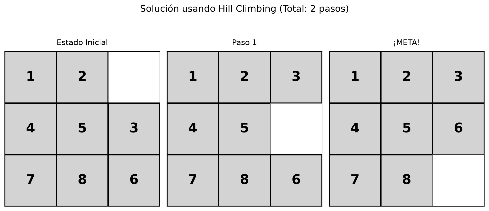
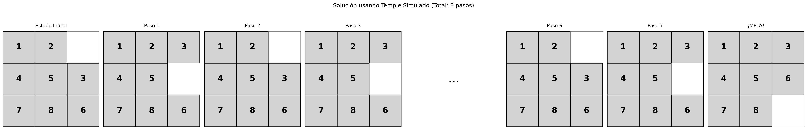
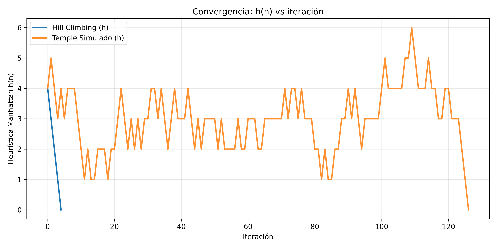
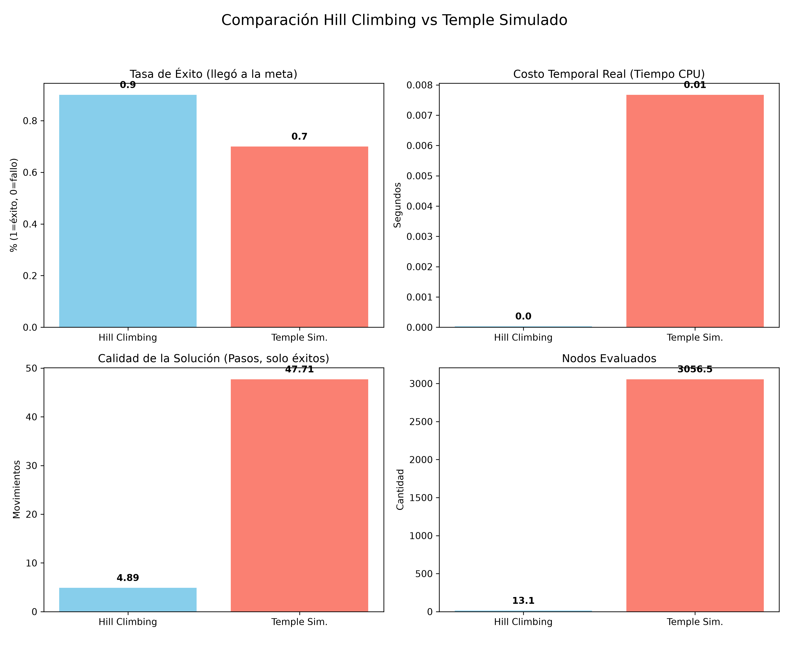

# Ascenso de Colinas y Temple Simulado en el 8-Puzzle (3x3)

Estudio comparativo de búsqueda local informada: **Hill Climbing (HC)** frente a **Simulated Annealing / Temple Simulado (TS)** en el puzzle 3x3, con heurística Manhattan, funciones en español y análisis de complejidad teórica y empírica.

Archivo principal: `puzzle_colinas_temple.py` · Requiere `Python 3.10+`, `numpy`, `matplotlib`.

## Resumen

Se implementan dos algoritmos de búsqueda local para el 8-puzzle y se comparan en 30 partidas por nivel de dificultad (8, 12, 20 y 30 movimientos de mezcla desde la meta). HC obtiene mayor tasa de éxito, menor tiempo, menos nodos evaluados y caminos más cortos en todos los niveles. TS es entre 300 y 700 veces más costoso y genera caminos entre 5 y 8 veces más largos, aunque en casos puntuales escapa de mínimos locales donde HC se bloquea. Para este dominio y esta parametrización, HC es la opción preferente; TS solo se justifica con reinicios o como mecanismo de escape.

## 1. Planteamiento del problema

Estado: tupla de 9 posiciones `(1,2,3,4,5,6,7,8,0)` donde `0` es el hueco. Meta: `(1,2,3,4,5,6,7,8,0)`. Operadores: mover el hueco arriba, abajo, izquierda o derecha si es legal. Factor de ramificación `b = 2 en esquina, 3 en borde, 4 en centro, promedio 2.67`. Espacio total soluble: `9!/2 = 181440` estados. La generación por mezcla aleatoria desde la meta garantiza solubilidad sin necesidad de filtrar por paridad de inversiones.

## 2. Por qué distancia Manhattan

Se utiliza `h(n) = distancia_manhattan(n)` como heurística principal por cuatro razones formales y una práctica:

1. **Admisible y consistente.** Manhattan nunca sobrestima el número real de movimientos restantes, porque cada ficha necesita al menos su distancia en grilla y cada movimiento mueve una sola ficha una casilla. Al ser admisible y consistente, es la referencia estándar en 8-puzzle (Russell y Norvig) y define un paisaje con gradiente útil para búsqueda local.

2. **Domina a fichas descolocadas.** Sea `h1` = fichas fuera de lugar y `h2` = Manhattan. Para todo estado, `h2 >= h1`, y `h2` es estrictamente más informativa. Ejemplo: `(1,2,0,4,5,3,7,8,6)` tiene `h1 = 2` y `h2 = 2`; `(2,5,3,4,0,6,7,1,8)` tiene `h1 = 5` y `h2 = 6`. En el segundo caso Manhattan distingue mejor la lejanía real. Con `h1` el paisaje está lleno de mesetas (muchos vecinos con igual valor); con `h2` hay menos empates y HC recibe mejor dirección.

3. **Granularidad.** `h1` toma valores en 0..8; `h2` en 0..~30. Esa resolución reduce mesetas y permite a HC elegir el steepest descent sin azar excesivo, y a TS calcular `delta` significativo para `exp(-delta/T)`.

4. **Costo despreciable.** `O(9) = O(1)` por evaluación, medido en `~1.59 microseg`. Evaluar 2 a 4 vecinos por paso en HC es trivial; evaluar 10000 iteraciones en TS sigue siendo del orden de milisegundos.

No se usa distancia euclidiana porque sobrestima en grilla con movimientos 4-conexos y no es admisible para este operador.

## 3. Algoritmos implementados

**`ascenso_colinas(estado, funcion_heuristica=distancia_manhattan, max_iter=5000, sideways_limit=50)`.** Steepest descent: evalúa todos los vecinos, migra al de menor `h`. Si mejora, continúa; si empata y quedan laterales, cruza la meseta; si no, declara `mínimo local` o `meseta`. Retorna éxito, tiempo, nodos evaluados, camino, memoria e historial de `h`. Variante `ascenso_colinas_reinicios` con 20 reinicios aleatorios para escapar de forma sistemática.

**`temple_simulado(estado, funcion_heuristica=distancia_manhattan, T_inicial=2.0, alpha=0.99, T_min=0.001, max_iter=10000)`.** En cada iteración `k` elige un vecino al azar. Si `delta = h(vecino)-h(actual) < 0`, acepta. Si no, acepta con probabilidad `exp(-delta/T)` con `T = T_inicial * alpha^k`. Se calibró `T_inicial=2.0` porque con `20.0` el algoritmo divagaba y caía a 20% de éxito; con `2.0` sube a ~70% en niveles fáciles. Retorna las mismas métricas más historial de `T`.

## 4. Metodología experimental

Dificultad controlada por número de movimientos aleatorios desde la meta: 8, 12, 20 y 30. Treinta partidas independientes por nivel, semilla fija `123` para reproducibilidad. Métricas por partida: éxito (llega a `h=0`), tiempo CPU, nodos evaluados (HC cuenta vecinos evaluados por paso; TS cuenta 1 por iteración), longitud del camino en éxitos y memoria (longitud de trayectoria). Funciones de graficado: `graficar_camino`, `graficar_convergencia`, `graficar_comparacion`, `graficar_enfriamiento`, `graficar_escala_dificultad`. Punto de entrada `simulacion_completa` y estudio `estudiar_dificultad`.

```bash
pip install matplotlib numpy
python puzzle_colinas_temple.py
```

## 5. Resultados

### 5.1 Tabla comparativa (30 partidas por nivel)

| Mezcla | HC éxito | HC tiempo | HC nodos | HC pasos* | TS éxito | TS tiempo | TS nodos | TS pasos* |
|---|---|---|---|---|---|---|---|---|
| 8 | 83.3% | 0.045 ms | 9.9 | 3.3 | 70.0% | 13.4 ms | 3029 | 26.9 |
| 12 | 93.3% | 0.034 ms | 10.4 | 3.6 | 66.7% | 16.5 ms | 3368 | 34.0 |
| 20 | 73.3% | 0.067 ms | 14.2 | 5.7 | 40.0% | 24.7 ms | 6015 | 27.0 |
| 30 | 46.7% | 0.034 ms | 12.8 | 6.1 | 33.3% | 24.7 ms | 6684 | 36.2 |

\* Pasos promediados solo sobre éxitos.

### 5.2 Caminos representativos




HC resuelve un caso a 2 movimientos en 2 pasos óptimos. TS resuelve el mismo caso en 8 a 14 pasos por desvíos estocásticos en fase caliente.

### 5.3 Convergencia de h(n)



HC desciende de forma monótona. TS oscila: sube a `h=4-6` aun partiendo de `h=2` y luego desciende, evidencia del escape probabilístico.

### 5.4 Comparación agregada



La tasa de éxito, el tiempo, los pasos y los nodos confirman la misma jerarquía en el corte de 10 partidas a 12 movimientos: HC 90% frente a TS 70%, con dos órdenes de magnitud menos costo.

### 5.5 Escalado con la dificultad


Ambas curvas de éxito caen con la mezcla, pero la de HC se mantiene por encima. Tiempo y nodos de TS crecen en escala logarítmica muy por encima de HC; la calidad de solución de TS permanece deficiente incluso cuando acierta.

## 6. Complejidad computacional

Teórica. HC: tiempo `O(d * b * Ch)` con `d` pasos hasta mínimo local, `b~2.67`, `Ch=O(1)`; peor caso `O(max_iter * b)`. Espacio `O(d)`, solo camino actual. TS: tiempo `O(Nmax)` con `Nmax=10000`; espacio `O(L)` si se guarda trayectoria o `O(1)` si solo actual y mejor. HC es incompleto y no óptimo; TS es probabilísticamente completo solo con enfriamiento logarítmico infinitamente lento, en la práctica con enfriamiento exponencial es incompleto con capacidad de escape.

Empírica. HC: 0.03-0.06 ms y 10-14 nodos medios, independiente de la dificultad hasta 30 movs. TS: 13-25 ms y 3000-6600 nodos medios, con crecimiento claro en dificultad. Relación de costo 300x-700x en tiempo y 300x-500x en nodos a favor de HC.

## 7. Discusión: cuál es mejor en este caso y por qué

Para este 8-puzzle con Manhattan y mezcla de 8 a 30 movimientos, **HC es mejor**. Tres motivos verificables: primero, el paisaje Manhattan cercano a la meta es suficientemente convexo para que el gradiente avaro acierte sin necesidad de aceptar peores; segundo, TS paga el escape incluso cuando no lo necesita, se aleja en fase caliente y luego debe volver, lo que infla tiempo, nodos y pasos; tercero, la calibración muestra que subir `T0` empeora (20.0 da 20% frente a 70% con 2.0), señal de que la exploración extra destruye más de lo que repara en este dominio.

TS solo supera a HC de forma puntual: estados en mínimo local estricto donde todos los vecinos tienen igual o peor `h` y se agota el límite lateral. En esos casos documentados HC retorna `mínimo local` y TS, con probabilidad positiva, transita a peor y continúa. Esa ventaja no compensa el promedio, salvo que se combine con reinicios.

## 8. Conclusiones

1. HC domina en éxito, tiempo, memoria y calidad de camino en los cuatro niveles evaluados.
2. Manhattan es condición necesaria de ese resultado: sin su granularidad y admisibilidad, HC sufriría más mesetas y TS perdería calibración de `delta/T`.
3. TS no es inútil: es el mecanismo de escape para mínimos donde HC se detiene, pero como algoritmo puro es ineficiente aquí.
4. La configuración recomendada es HC como base y `ascenso_colinas_reinicios` para robustez cercana al 100%, reservando TS con `T0` bajo o reheating solo para análisis de escape.
5. Trabajo futuro: `T0` adaptativo a `h` inicial, enfriamiento por tramos y comparación con A* óptimo como cota superior.

## 9. Reproducibilidad

Funciones y parámetros en español en `puzzle_colinas_temple.py`. Semillas fijadas en `simulacion_completa` (42) y `estudiar_dificultad` (123). Las figuras de este README se regeneran al ejecutar el script.
